# Portfolio02 アーキテクチャ図集

## 2. アーキテクチャ & DDD/HAレイヤ図

```mermaid
graph TB
    %% Hexagonal Architecture with Ports
    subgraph "🎯 Core Domain"
        DOMAIN[packages/domain<br/>DDD Entities & Services<br/>+ Repository Ports]
        VALIDATORS[packages/validators<br/>Zod Schemas<br/>Input Validation]
        API[packages/api<br/>tRPC Router<br/>Application Logic]
    end

    %% Primary Adapters (Driving)
    UI[packages/ui<br/>React Components<br/>📱 Primary Adapter]
    NEXT[apps/nextjs<br/>Next.js App<br/>📱 Primary Adapter]

    %% Secondary Adapters (Driven)
    DB[packages/db<br/>Drizzle ORM<br/>🔌 implements Repository Ports]
    EXTERNAL[packages/external<br/>External APIs<br/>🔌 partially implements Ports]

    %% Connections - Primary Adapters drive the core
    UI --> API
    NEXT --> UI
    NEXT --> API

    %% Connections - Application uses Domain
    API --> DOMAIN
    API --> VALIDATORS

    %% Port-Adapter connections
    DB -.->|implements Repository Ports| DOMAIN
    EXTERNAL -.->|partially implements Ports| DOMAIN

    classDef primary fill:#e1f5fe
    classDef core fill:#f3e5f5
    classDef secondary fill:#e8f5e8

    class UI,NEXT primary
    class DOMAIN,VALIDATORS,API core
    class DB,EXTERNAL secondary
```

### 設計原則

- **依存関係の逆転**: インフラ層がドメイン層に依存
- **単一責任の原則**: 各パッケージが明確な役割を持つ
- **疎結合**: tRPCによる型安全なAPI境界
- **テスタビリティ**: 各層が独立してテスト可能
