# ポートフォリオサイト技術説明ページ構成案

## ページ目的

**大目的**: ポートフォリオサイトの技術力・実装品質の可視化とアピール材料化  
**中目的**: 周辺技術エコシステムの可視化ページ作成  
**コンセプト**: 「1つのサイトを作るだけなのに、なぜこれだけの技術が必要だったのか」を価値別に説明

## ストーリー構成

### 1. 本番システム構成図の提示

- **visual**: `portfolio-contact.drawio.light.svg` を掲載
- **説明**: 「このポートフォリオサイトの技術構成図です」

### 2. 業務継続運用の前提設定

**導入文**:

> 「もしこのサイトをチームで開発し、長期間安定運用する必要があるとしたら...」

**3つの要件提示**:

- **チーム開発の必要性** - 協働・品質統一・属人化排除
- **長期運用の必要性** - 保守性・拡張性・継続的改善
- **安定運用の必要性** - 障害対応・セキュリティ・パフォーマンス

### 3. 技術エコシステム全体像

**visual**: 中心に本番構成、周辺に127項目技術要素を配置した図

```mermaid
graph TB
    %% 中心システム
    PROD[("Portfolio Site<br/>本番システム")]

    %% 4つの価値軸
    EFFICIENCY["★開発効率"]
    QUALITY["★品質確保"]
    SECURITY["★セキュリティ"]
    OPERATIONS["★運用保守"]

    %% 中心から価値軸への接続
    PROD --> EFFICIENCY
    PROD --> QUALITY
    PROD --> SECURITY
    PROD --> OPERATIONS

    %% 各価値軸の主要技術
    EFFICIENCY --> E1["モノレポ管理"]
    EFFICIENCY --> E2["環境分離"]
    EFFICIENCY --> E3["ビルド最適化"]

    QUALITY --> Q1["5層テスト設計"]
    QUALITY --> Q2["TypeScript型安全性"]
    QUALITY --> Q3["コード品質チェック"]

    SECURITY --> S1["4層防御システム"]
    SECURITY --> S2["Zod入力検証・XSS対策"]
    SECURITY --> S3["リアルタイム監視"]

    OPERATIONS --> O1["CI/CD自動化"]
    OPERATIONS --> O2["バックアップ・復旧"]
    OPERATIONS --> O3["パフォーマンス監視"]

    %% スタイル
    classDef prodStyle fill:#4f46e5,color:#fff,stroke:#4f46e5,stroke-width:4px
    classDef categoryStyle fill:#6b7280,color:#fff,stroke:#6b7280,stroke-width:3px
    classDef qualityStyle fill:#10b981,color:#fff,stroke:#10b981,stroke-width:2px
    classDef efficiencyStyle fill:#3b82f6,color:#fff,stroke:#3b82f6,stroke-width:2px
    classDef securityStyle fill:#ef4444,color:#fff,stroke:#ef4444,stroke-width:2px
    classDef operationsStyle fill:#f59e0b,color:#fff,stroke:#f59e0b,stroke-width:2px

    class PROD prodStyle
    class EFFICIENCY,QUALITY,SECURITY,OPERATIONS categoryStyle
    class E1,E2,E3 efficiencyStyle
    class Q1,Q2,Q3 qualityStyle
    class S1,S2,S3 securityStyle
    class O1,O2,O3 operationsStyle
```

- 色分け: カテゴリ別（品質=緑、効率=青、セキュリティ=赤、運用=橙）
- 接続線: 本番システムとの依存関係を表現

### 4. 4つの価値軸での技術説明

#### A. 品質確保のために

**なぜ必要?**: チーム開発での品質統一・バグ防止
**技術要素**:

- 5層テスト設計（Unit・Database・External・UI・E2E）
- TypeScript型安全性・Zod入力検証
- ESLint・Prettier・textlint品質チェック
- カバレッジ監視・継続的品質追跡

#### B. 開発効率のために

**なぜ必要?**: チーム協働での開発スピード・一貫性確保
**技術要素**:

- Turborepo + pnpm catalog モノレポ管理
- 環境分離（開発・テスト・本番）
- Hot reload・高速ビルド・キャッシュ最適化
- 自動化（依存関係更新・コード生成）

#### C. セキュリティのために

**なぜ必要?**: 長期運用での攻撃対策・信頼性確保
**技術要素**:

- 4層防御（Rate Limiting・Bot検知・DDoS・認証）
- 包括的入力検証・XSS対策・SQL Injection防止
- Redis基盤リアルタイム監視・Slack通知
- 脆弱性監査・継続的セキュリティ

#### D. 運用・保守のために

**なぜ必要?**: 安定運用での障害対応・継続的改善
**技術要素**:

- CI/CD自動化・GitHub Actions最適化
- バックアップ自動化・障害復旧
- パフォーマンス監視・メトリクス分析
- Forward-only Recovery・Graceful Degradation

## 技術要素詳細リスト

### 参照ドキュメント

- `docs/technical-achievements-summary.md` - 127項目技術要素の詳細
- 実装済み技術の具体的な設定・コード例を併記

### カテゴリ分類

**品質確保** (Quality Assurance):

- テスト関連技術
- 型安全性・バリデーション
- コード品質チェック

**開発効率** (Development Efficiency):

- ビルドシステム・ツール
- 環境管理・自動化
- 開発体験向上

**セキュリティ** (Security):

- 攻撃対策・防御システム
- 入力検証・脆弱性対策
- 監視・通知システム

**運用・保守** (Operations & Maintenance):

- CI/CD・デプロイ
- 監視・バックアップ
- 障害対応・復旧

## ページ構成要素

### Visual要素

1. **本番構成図** - portfolio-contact.drawio.light.svg
2. **技術エコシステム図** - 127項目を価値別に配置した全体図
3. **カテゴリ別詳細図** - 各価値軸での技術要素詳細

### Text要素

1. **導入文** - 業務運用前提の説明
2. **価値軸説明** - なぜその技術が必要だったか
3. **技術詳細** - 具体的な実装・設定内容
4. **結論** - エンタープライズレベル技術基盤の個人実現

## 実装方針

### 作成ツール候補

- **図作成**: draw.io / Lucidchart / Mermaid
- **ページ実装**: Next.js ページとして組み込み
- **レスポンシブ**: モバイル対応の図・レイアウト

### 技術的実装

- SVG形式での図埋め込み
- インタラクティブ要素（hover・クリックでの詳細表示）
- SEO対策（技術キーワードでの検索性向上）

## 期待される効果

### 採用・技術アピール

- エンタープライズレベル技術基盤の証明
- 個人プロジェクトでの企業レベル開発体制実現
- 現代的開発手法の習得・実践力の可視化

### 技術的差別化

- 単なる技術一覧ではない「価値・必要性」ベースの説明
- 実装の具体性（127項目の詳細な技術要素）
- 体系的なアプローチ（4つの価値軸での整理）
