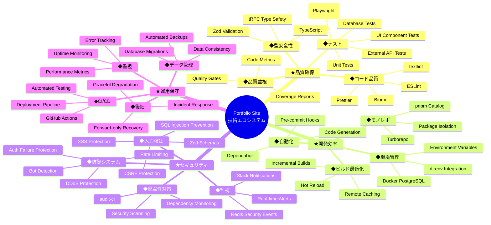
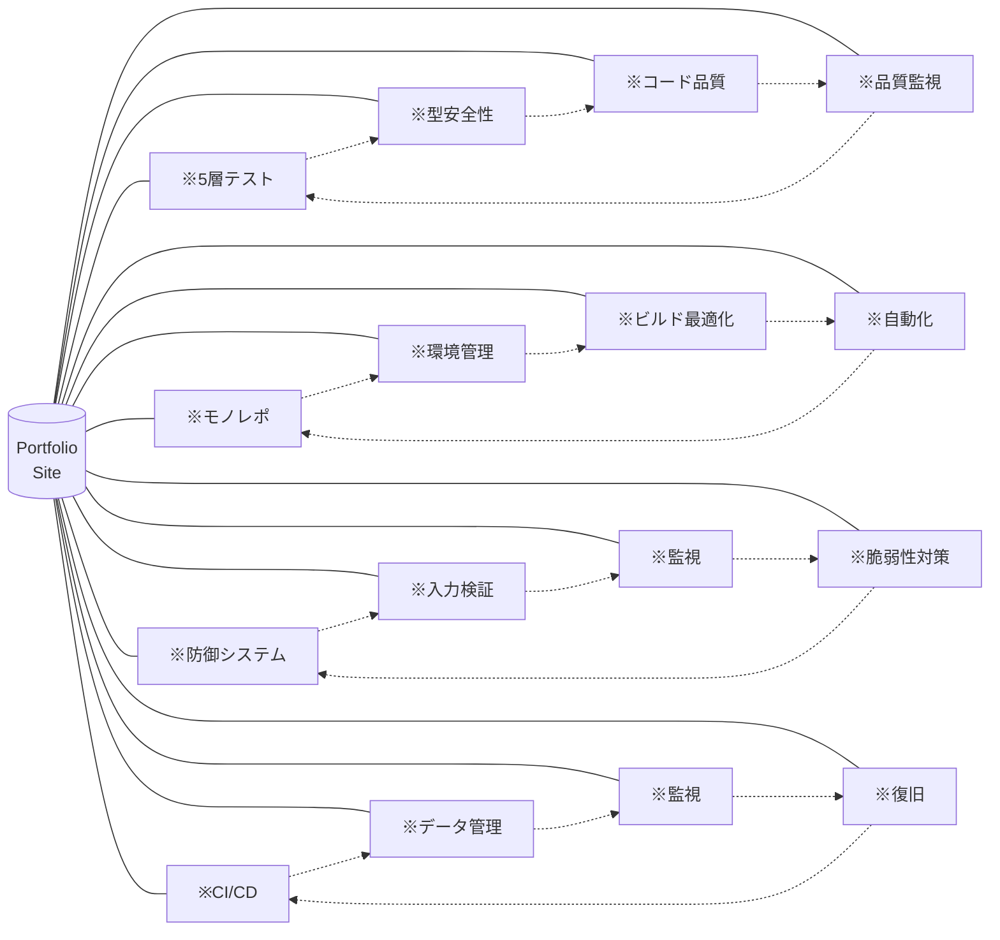

# 技術エコシステム図（Mermaid版）

## 全体構成図

```mermaid
graph TB
    %% 中心の本番システム
    PROD[("Portfolio Site<br/>(本番システム)")]

    %% 品質確保（緑系）
    subgraph QUALITY ["★品質確保のために"]
        TEST["※5層テスト設計<br/>Unit・DB・External・UI・E2E"]
        TYPE["※TypeScript型安全性<br/>Zod入力検証"]
        LINT["※ESLint・Prettier<br/>textlint品質チェック"]
        COV["※カバレッジ監視<br/>継続的品質追跡"]
    end

    %% 開発効率（青系）
    subgraph EFFICIENCY ["★開発効率のために"]
        MONO["※Turborepo + pnpm<br/>モノレポ管理"]
        ENV["※環境分離<br/>開発・テスト・本番"]
        BUILD["※Hot reload・高速ビルド<br/>キャッシュ最適化"]
        AUTO["※自動化<br/>依存関係更新・コード生成"]
    end

    %% セキュリティ（赤系）
    subgraph SECURITY ["★セキュリティのために"]
        DEFENSE["※4層防御<br/>Rate Limiting・Bot検知・DDoS・認証"]
        VALIDATION["※包括的入力検証<br/>XSS対策・SQL Injection防止"]
        MONITOR["※Redis基盤リアルタイム監視<br/>Slack通知"]
        AUDIT["※脆弱性監査<br/>継続的セキュリティ"]
    end

    %% 運用・保守（橙系）
    subgraph OPERATIONS ["★運用・保守のために"]
        CICD["※CI/CD自動化<br/>GitHub Actions最適化"]
        BACKUP["※バックアップ自動化<br/>障害復旧"]
        PERF["※パフォーマンス監視<br/>メトリクス分析"]
        RECOVERY["※Forward-only Recovery<br/>Graceful Degradation"]
    end

    %% 接続関係
    PROD -.-> TEST
    PROD -.-> TYPE
    PROD -.-> LINT
    PROD -.-> COV

    PROD -.-> MONO
    PROD -.-> ENV
    PROD -.-> BUILD
    PROD -.-> AUTO

    PROD -.-> DEFENSE
    PROD -.-> VALIDATION
    PROD -.-> MONITOR
    PROD -.-> AUDIT

    PROD -.-> CICD
    PROD -.-> BACKUP
    PROD -.-> PERF
    PROD -.-> RECOVERY

    %% スタイル設定
    classDef prodStyle fill:#4f46e5,color:#fff,stroke:#4f46e5,stroke-width:3px
    classDef qualityStyle fill:#10b981,color:#fff,stroke:#10b981,stroke-width:2px
    classDef efficiencyStyle fill:#3b82f6,color:#fff,stroke:#3b82f6,stroke-width:2px
    classDef securityStyle fill:#ef4444,color:#fff,stroke:#ef4444,stroke-width:2px
    classDef operationsStyle fill:#f59e0b,color:#fff,stroke:#f59e0b,stroke-width:2px

    class PROD prodStyle
    class TEST,TYPE,LINT,COV qualityStyle
    class MONO,ENV,BUILD,AUTO efficiencyStyle
    class DEFENSE,VALIDATION,MONITOR,AUDIT securityStyle
    class CICD,BACKUP,PERF,RECOVERY operationsStyle
```

## 詳細版（技術要素展開）

```mermaid
mindmap
  root((Portfolio Site<br/>技術エコシステム))
    ★品質確保
      ◆テスト
        Unit Tests
        Database Tests
        External API Tests
        UI Component Tests
        E2E Tests (Playwright)
      ◆型安全性
        TypeScript
        Zod Validation
        tRPC Type Safety
      ◆コード品質
        ESLint
        Prettier
        Biome
        textlint
      ◆品質監視
        Coverage Reports
        Code Metrics
        Quality Gates
    ★開発効率
      ◆モノレポ
        Turborepo
        pnpm Catalog
        Package Isolation
      ◆環境管理
        Docker PostgreSQL
        Environment Variables
        direnv Integration
      ◆ビルド最適化
        Hot Reload
        Incremental Builds
        Remote Caching
      ◆自動化
        Dependabot
        Code Generation
        Pre-commit Hooks
    ★セキュリティ
      ◆防御システム
        Rate Limiting
        Bot Detection
        DDoS Protection
        Auth Failure Protection
      ◆入力検証
        Zod Schemas
        SQL Injection Prevention
        XSS Protection
        CSRF Protection
      ◆監視
        Redis Security Events
        Real-time Alerts
        Slack Notifications
      ◆脆弱性対策
        audit-ci
        Security Scanning
        Dependency Monitoring
    ★運用保守
      ◆CI/CD
        GitHub Actions
        Automated Testing
        Deployment Pipeline
      ◆データ管理
        Automated Backups
        Database Migrations
        Data Consistency
      ◆監視
        Performance Metrics
        Error Tracking
        Uptime Monitoring
      ◆復旧
        Forward-only Recovery
        Graceful Degradation
        Incident Response
```

## レイアウト案（放射状）

```mermaid
graph LR
    %% 中心
    CENTER[("Portfolio<br/>Site")]

    %% 品質確保（上）
    Q1["※5層テスト"]
    Q2["※型安全性"]
    Q3["※コード品質"]
    Q4["※品質監視"]

    %% 開発効率（右）
    E1["※モノレポ"]
    E2["※環境管理"]
    E3["※ビルド最適化"]
    E4["※自動化"]

    %% セキュリティ（下）
    S1["※防御システム"]
    S2["※入力検証"]
    S3["※監視"]
    S4["※脆弱性対策"]

    %% 運用保守（左）
    O1["※CI/CD"]
    O2["※データ管理"]
    O3["※監視"]
    O4["※復旧"]

    %% 接続
    CENTER --- Q1
    CENTER --- Q2
    CENTER --- Q3
    CENTER --- Q4

    CENTER --- E1
    CENTER --- E2
    CENTER --- E3
    CENTER --- E4

    CENTER --- S1
    CENTER --- S2
    CENTER --- S3
    CENTER --- S4

    CENTER --- O1
    CENTER --- O2
    CENTER --- O3
    CENTER --- O4

    %% カテゴリ配置
    Q1 -.-> Q2
    Q2 -.-> Q3
    Q3 -.-> Q4
    Q4 -.-> Q1

    E1 -.-> E2
    E2 -.-> E3
    E3 -.-> E4
    E4 -.-> E1

    S1 -.-> S2
    S2 -.-> S3
    S3 -.-> S4
    S4 -.-> S1

    O1 -.-> O2
    O2 -.-> O3
    O3 -.-> O4
    O4 -.-> O1
```
